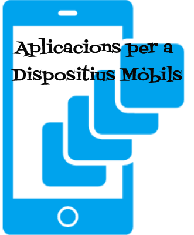

---
title: "AMD-00 (102386): Course Presentation"
subtitle: "Applications for mobile devices & Fall 2020-2021"
keywords: "lecture, markdown, android, apps, software development,"
author: "Jordi Mateo Fornés <jordi.mateo@udl.cat>"
copyright: "(c) 2020-2021 University of Lleida (Jordi Mateo)"
license: "MIT"
...

Presentation
-------------

::: columns
::: {.column width="30%"}

::: center

:::

:::
::: {.column width="60%"}

* Dr. Jordi Mateo Fornés
* **Office**:
  * Office A.12 (Campus Igualada)
  * Office 3.08 (EPS Lleida)
* **Email**: jordi.mateo@udl.cat
* **Twitter**: [https://twitter.com/MatForJordi](https://twitter.com/MatForJordi)
* **Github**: [https://github/JordiMateoUdL](https://github.com/JordiMateoUdL/)

:::
:::

Course
-------

::: columns
::: {.column width="30%"}
::: center

:::
:::
::: {.column width="60%"}
:::center

* **Applications for mobile devices**.
* [Grau en Tècniques d'Interacció Digital i de Computació](http://www.grauinteraccioicomputacio.udl.cat/ca/index.html)
* [Campus Igualada](http://www.campusigualada.udl.cat/ca/) - [Escola Politècnica Superior](http://www.eps.udl.cat/ca/) - [Universitat de Lleida](http://www.udl.cat/ca/)
* All the code developed in this course can be found in this repository: [DAM Course](https://github.com/JordiMateoUdL/Development-of-Mobile-Applications).

:::
:::
:::

Agenda
=======

1. Introduction
2. Mobile Platforms
3. API Frameworks
4. Current trends and Overview
5. Course: 102386

Introduction
==================

Context
--------

* What do you expect to learn?
* What should you learn?

::: cbox
**[Please use this jamboard to answer: [Jam-DAM-vl00](https://jamboard.google.com/d/1ZhPHVtKiSSCgtVHoMquhEWBv3tvpheJwptJakbbjjZg/edit?usp=sharing).]{.alert}**
:::

Mobile devices App development
-------------------------------

* Programming is easy, but software engineering is hard. [@Hunt2000]
* Developing apps is multidisciplinary [@Martin2008]
  * Write code.
  * Develop or use third-party APIs.
  * Design and scalable and maintainable architecture.
  * Creative and Usable design.

Warm-Up (1)
-----------

::: columns
::: {.column width="40%"}
::: center
{width=70%}\
:::
:::
::: {.column width="60%"}
* Care about your craft: Why spend your life developing code unless you care about doing well?
* Don't live with broken windows. Fix bad designs, wrong decisions or poor code asap.
* DRY. Do not repeat your self.
* Make it easy to reuse
* Don't think outside the box - Find the box: We faced with an impossible problem, identify real constrains. Does it have to be done this way? Does it have to be done at all?
:::
:::

Warm-Up (2)
------------

::: columns
::: {.column width="60%"}
::: center
{width=70%}\
:::
:::
::: {.column width="40%"}
* Don't be afraid to say "I don't know"
.. but follow it up with:
"I'll find out"
* Work with a user to think like a user.
* Test early, test often, test automatically.
* Estimate the order of your algorithms.
* Write code that writes code.
:::
:::

What should you learn?
------

::: columns

::: {.column width="50%"}
Tools
------
* IDE
* Sketch, JustinMind, AdoveXD
* GIT
* Issue trackers
* Slack
:::
::: {.column width="50%"}

Workflow
--------
* Agile methods
* Git flow
* Review code
* Testing
* Integration
:::
:::

Mobile Platforms
==================

Mobile Platforms (1)
-----------------

* What mobile platforms do you know?
* What is your experience?

Mobile Platforms (2)
-----------------

* Native tools:
  * Android
  * iOs
* Cross-platform tools:
  * PhoneGap
  * React Native
  * Xamarin
  * Flutter
  * Kotlin Native

Native vs Cross-Platform (1)
----------------------------

* Native tools:
  * Allows users to learn quickly.
  * Easy to discover (Play Store or Apple Store).
  * Easy to use the device hardware.
  * High Performance and Great UX.
* Cross-Platform tools:
  * Portability.
  * Faster development.
  * Cheaper.
  * Easy to support and maintain.

Native vs Cross-Platform (2)
----------------------------

What is the best option? **It depends**. Everyone needs to choose the one that suits their needs in a better way.

Consider:

* One or multiple platforms
* Cost
* Technology

Android
--------

* Advantages
  * Kotlin as a programming language.
  * Mature architecture.
  * ConstraintLayout 2.0.
  * Google is behind
* Disadvantages
  * Fragmentation
  * Android X
* Tools
  * Android Studio, IntelliJ Idea, Visual...
  * Emulators available on all platforms

iOS
--------

* Advantages
  * Swift as a programming language.
  * Swift is open source.
  * Fast adoption of latest OS.
* Disadvantages
  * Cost
  * You need a mac to develop.
  * Strict App review.
* Tools
  * Xcode, AppCode

React Native
------------

* Backed by Facebook.
* Used by Instagram Facebook, Airbnb, Walmart, Tesla...
* React library and JavaScript to deliver a native experience on iOS and Android
* Fast development.

Ionic
------

* Makes the best use of web tech HTML, CSS, javascript.
* Cordova to wrap the apps in native containers.
* Built on Angular.
* Strong community support.
* Highly interactive apps.
* Easy learning curve.

Flutter
--------

* Backed by Google.
* Used by Alibaba, Hamilton Musical, Google Ads,...
* High performance.
* Dart is a modern, multi-paradigm and objected-oriented programming for building web apps, mobile apps, and desktop apps.
  
API Frameworks
================

Most common (API Frameworks)
----------------------------

* Spring
* Django
* Flask
* Falcon
* Express (NodeJS)
* Ruby on Rails

Overview
============

Developers
------------

::: center
{width=60%}\
:::

Users
------

::: center
{width=70%}\
:::

Languages
---------

::: center
{width=70%}\
:::

Course: 102386
========

Objectives
-----------

* Understand the Android platform and the elements that make it up.
* Understand and use coding patterns.
* Develop applications for the Android operating system.
* Establish the bases for implementing additional functionalities (access to the database, access to resources and features of the mobile, etc.).
* Develop and use API as a backend.
* Get to know the step of publishing Android applications.

Architecture to learn (1)
----------------------

::: center
{width=70%}\
:::

APIs and Services
----------------------

::: center
{width=65%}\
:::

Evaluation
-------------

You must pass both exams with a minimum mark of 5 to pass the course.

* **First Exam (P1)**: *15%* Live coding exam.
* **First Exam (P2)**: *15%* Live coding exam.
  
* **Project**: Development of your own app. **50%**.
  * **Milestone 1 (M1)**: *12%*.
  * **Milestone 2 (M2)**: *14%*.
  * **Milestone 3 (M3)**: *24%*.
* **Common Part**: *20%*. (Projecte Integrador)

Code Evaluation
-----------------

::: center
{width=70%}\
:::

Methodology
-----------

* Students must perform the proposed **HandsOn** in the field before the sessions. The live sessions will serve to agree on doubts and expand the concepts worked on in the **HandsOn** (1h).
* Practical sessions will be focused on realizing the implementation of the project.  However, a few sessions will be aimed to perform some workshops during the season of live coding (2h).
* Open Source and pragmatic methodology, all your development must be public in Github.
* Functional deliveries, with constant feedback and suggestions allow students to pivoting  and make corrections.

Project using DevOps
---------------------

* GitFlow:
  * Develop branch: All development until next release.
  * Master branch: Most recent release.
  * Features: Develop isolate feature and merge/rebase then in the develop branch.
  * **HandsOn 01**: [Digging into Git](https://cv.udl.cat/portal/directtool/e5931457-d3b2-4ca0-8ffe-7405d6f56124/)
* Project Management (Agile and Scrum):
  * Project definition and planning
  * Project launch and execution
  * Performance and control
  * Project close
* Docker:
  * Containerizing the applications to support the development and quick releases.

What languages you should learn?
-----------------------------

* **Mandatory**:
  * *Android Programming*:
    * JAVA
    * KOTLIN
  * *Backend Programming*:
    * Python (Falcon)

* **Optional** (depending time, availability and your motivation):
  * *Cross-Platform Programming*:
    * Flutter
  * *Game development*:
    * Unity
  
Java
-----

* Advantages:
  * Easy to learn, understand, and flexible.
  * A good choice for cross-platform apps.
  * Java has an extensive open-source ecosystem.
  * More compact and light apps.
  * Fast build compared with Kotlin.
* Disadvantages:
  * Limitations that causes problems in android design.
  * You need to write more.
  * Requires a lot of memory

Kotlin
------

* Advantages:
  * Easy to switch from Java.
  * Smart extensions to build.
  * More concise.
  * Compatible with all Java libraries, frameworks, and JVM.
  * Compatible with Gradle or Maven.
  * Fast build compared with Kotlin.
* Disadvantages:
  * Slower compilation.
  * Less community.
  * Not as mature as JAVA.

Comparative
------------

::: center
{width=60%}\
:::

That's all folks
------------------

www   --- [jordimateofornes.com](https://jordimateofornes.com)

github   --- [github.com/JordiMateoUdL](https://github.com/JordiMateoUdL)

twitter   --- [\@MatForJordi](https://twitter.com/MatForJordi)

gdc   --- [Distributed computation group](http://gcd.udl.cat)

**References**:
