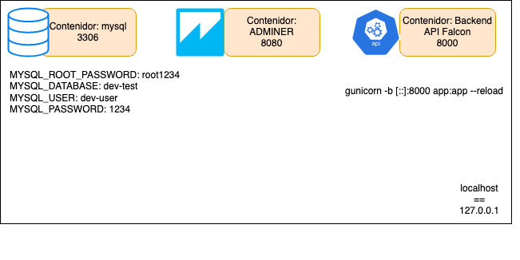

---
title: "AMD-01 (102386): Development Environment"
subtitle: "Applications for mobile devices & Fall 2020-2021"
keywords: "lecture, markdown, android, apps, software development,"
author: "Jordi Mateo Fornés <jordi.mateo@udl.cat>"
copyright: "(c) 2020-2021 University of Lleida (Jordi Mateo)"
license: "MIT"
...

Presentation
-------------

::: columns
::: {.column width="30%"}

::: center

:::

:::
::: {.column width="60%"}

* Dr. Jordi Mateo Fornés
* **Office**:
  * Office A.12 (Campus Igualada)
  * Office 3.08 (EPS Lleida)
* **Email**: jordi.mateo@udl.cat
* **Twitter**: [https://twitter.com/MatForJordi](https://twitter.com/MatForJordi)
* **Github**: [https://github/JordiMateoUdL](https://github.com/JordiMateoUdL/)

:::
:::

Course
-------

::: columns
::: {.column width="30%"}
::: center


:::
:::
::: {.column width="60%"}
:::center

* **Applications for mobile devices**.
* [Grau en Tècniques d'Interacció Digital i de Computació](http://www.grauinteraccioicomputacio.udl.cat/ca/index.html)
* [Campus Igualada](http://www.campusigualada.udl.cat/ca/) - [Escola Politècnica Superior](http://www.eps.udl.cat/ca/) - [Universitat de Lleida](http://www.udl.cat/ca/)
* All the code developed in this course can be found in this repository: [DAM Course](https://github.com/JordiMateoUdL/Development-of-Mobile-Applications).

:::
:::
:::

Agenda
=======

1. HandsOn01 feedback, comments, and discussion.
2. Prepare the development environment and tools
3. Introduction to Falcon
4. DAMCore
5. Production remote environment

HandsOn01
==================

* I expect that this first hands-on was really easy for the majority?
* Do you want/need another similar but remote git tracking, or do you think it will be boring?
* What is a pull request?
* What do you things about this hands-on methodology? Do you like it? Do you want more?

Prepare the development environment and tools
====================

Tools to install
--------

* Windows:
  * https://docs.docker.com/docker-for-windows/install/
* Linux:
  * https://computingforgeeks.com/install-docker-ce-on-linux-systems/
* Mac:
  * https://docs.docker.com/docker-for-mac/install/

* **Compose**: https://docs.docker.com/compose/install/

* **Postman:** https://www.postman.com/downloads/

Docker
--------

::: center
{width=70%}\
:::

Cheatsheet
-----------
::: center
{width=70%}\
:::

Docker-Compose (1)
---------------

```sh
# Starts existing containers for a service.
docker-compose start
# Stops running containers without removing them.
docker-compose stop
# Pauses running containers of a service.
docker-compose pause
# Unpauses paused containers of a service.
docker-compose unpause
# Lists containers.
docker-compose ps
```

Docker-Compose (2)
---------------

```sh
# Builds, (re)creates, starts, and attaches 
# to containers for a service.
docker-compose up (-d) (--build)
# Stops containers and removes containers, 
# networks, volumes, and images created by up.
docker-compose down
# Logs
docker-compose logs
```

Falcon
===========

Introduction
--------------

**Definition** minimalist Python web API framework for building reliable app backends and microservices. [@falcon]

The Falcon web framework encourages the **REST** architectural style. Resource classes implement HTTP method handlers that resolve requests and perform state transitions.

Features (1)
-----------

* Highly-optimized, extensible code base
* Intuitive routing via URI templates and REST-inspired resource classes
* Easy access to headers and bodies through request and response classes
* DRY request processing via middleware components and hooks
* Idiomatic HTTP error responses
* Straightforward exception handling
* Snappy unit testing through WSGI helpers and mocks
* CPython 2.6-2.7 and 3.4+, or PyPy 2.7 and 3.5+
* Cython support for an extra speed boost under CPython

People feedback
----------------

* We have been using Falcon as a replacement for [framework] and we simply love the performance (three times faster) and code base size (easily half of our original [framework] code).
* Falcon looks great so far. I hacked together a quick test for a tiny server of mine and was ~40% faster with only 20 minutes of work.” “Falcon is rock solid and it’s fast.
* I’m loving #falconframework! Super clean and simple, I finally have the speed and flexibility I need!
* I feel like I’m just talking HTTP at last, with nothing in the middle. Falcon seems like the requests of backend.
* The source code for Falcon is so good, I almost prefer it to documentation. It basically can’t be wrong.
* What other framework has integrated support for 786 TRY IT NOW ?

REST architectural style
---------------------------

```python
class QuoteResource:
    def on_get(self, req, resp):
        """Handles GET requests"""
        quote = {
            'quote': (
                "I've always been more interested in "
                "the future than in the past."
            ),
            'author': 'Grace Hopper'
        }
        resp.media = quote
api = falcon.API()
api.add_route('/quote', QuoteResource())
```

Middleware and Hooks
------------

Falcon supports before and after **hooks**. You install a hook simply by applying one of the decorators below, either to an individual responder or to an entire resource.

**Middleware** components provide a way to execute logic before the framework routes each request, after each request is routed but before the target responder is called, or just before the response is returned for each request. Components are registered with the middleware kwarg when instantiating Falcon’s API class.

Unlike hooks, middleware methods apply globally to the entire API.

DAMCore
=======

Overview
---------
::: center

:::

Workflow
--------

* **Project**:
  * Android folder
  * DamCore folder
  * Documentation
  * static folder
  * .gitignore (static folder...)

* Integrate this backend to the project:
  [Github](https://github.com/JordiMateoUdL/DAM-Retrofit).

Let us see the code and explore the repo.

Production remote environment
==============================

Servers:

* Group 1: 192.168.101.84
* Group 2: 192.168.101.85
* Group 3: 192.168.101.86

Install sftp (filezila (gui) or cmd) ssh(putt (windows) or cmd)

That's all folks
------------------

www   --- [jordimateofornes.com](https://jordimateofornes.com)

github   --- [github.com/JordiMateoUdL](https://github.com/JordiMateoUdL)

twitter   --- [\@MatForJordi](https://twitter.com/MatForJordi)

gdc   --- [Distributed computation group](http://gcd.udl.cat)

**References**:
