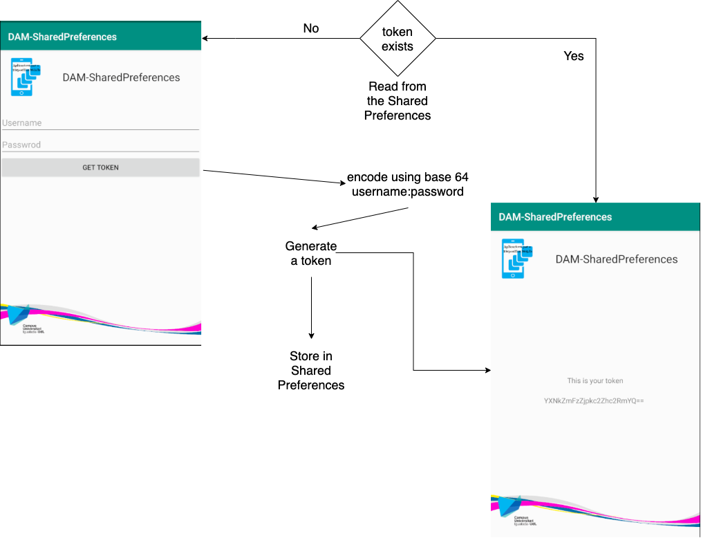

---
title: "AMD-08: SharedPreferences"
subtitle: "Applications for mobile devices & Course 2019-2020"
keywords: "lecture, markdown, android, apps"
author: "Jordi Mateo Fornés <jordi.mateo@udl.cat>"
copyright: "(c) 2019-2020 Jordi Mateo Fornés"
license: "MIT"

...

* Dr. Jordi Mateo Fornés
* **Office**:
  * Office A.12 (Campus Igualada)
  * Office 3.08 (EPS Lleida)
* **Email**: jordi.mateo@udl.cat
* Doubts
  * During class
  * After class
  * Email
    * Topic: [AMD]: XXXXXXXXX

Shared Preferences
===================================

Shared Preferences
-------------------

**Shared Preferences** is a Data Storage option provided by Android to store **primitive data**.
It works very close to dictionaries (*key*,*value*).

**Shared Preferences** act as a **Singleton**. So, for any particular set of preferences, there is a single instance of this class.
that all clients share. Modifications are done using *Editor* object to ensure a consistent state and control when they are committed to storage.

Information extracted from: **[Android Developers - Shared Preferences](https://developer.android.com/reference/android/content/SharedPreferences)**.

Methods
----------

* **edit()**: Obtain the editor to make modifications. Editor->commit() and Editor->apply().
* **getAll()**: Retrieve all values.
* **get{x}(key,defaultValue)()**: Retrieve the value of the primitive *x* with key *key*. If not found retrieve the *defaultValue*.
* **put{x}(key,value)()**: Save the value of the primitive *x* with key *key* and value *value*.

Notes
-------

* Persist data across user sessions.
* Data is kept even if the **application** is: **killed** or **restarted**.
* Moreover, the data is kept even if the **device** is **restarted**.
* Store user settings to be shared across different activities.
* Shared Preferences use **expensive operations** that can **slow down the app**.
* Shared Preferences data is **kept private** in the **context of the app**.

Hands-On
=========

Hands-On: Context
---------------------------

We are going to simulate a user login application that obtains a token from an API. We will keep all the functionality as simple as possible.

All the code is available in the Github   --- **[Code](https://github.com/JordiMateoUdL/DAM-SharedPreferences)**

Hands-On: App functions
---------------------------

:::center

:::

Hands-On: Preferences Provider
-------------------------------

:::center
*preferences/PreferencesProvider*
:::

* Create one shared preferences file.
* Select the Context Mode:
  * **Private**: Keep the files private and secure user's data.
  * **Public**: Public file accessible by other apps in the device.
  * **Append**: Append the new preferences with the already existing preferences.

Hands-On: App to init the Preferences Provider
------------------------------

We init the Preferences provider at the beginning.

```java
public class App extends Application {

    @Override
    public void onCreate() {
        super.onCreate();
        PreferencesProvider.init(this);
    }
}
```

Hands-On: Check the manifest
------------------------------

:::center
 android:name=".App"
:::

```java
<application
        android:allowBackup="true"
        android:icon="@mipmap/ic_launcher"
        android:label="@string/app_name"
        android:roundIcon="@mipmap/ic_launcher_round"
        android:supportsRtl="true"
        android:theme="@style/AppTheme"
        android:name=".App">
       ...
    </application>
```

Hands-On: Main Activity - Obtain shared preferences
------------------------

```java
private SharedPreferences mPreferences;
@Override
    protected void onCreate(Bundle savedInstanceState) {
      ...
      this.mPreferences = PreferencesProvider.providePreferences();
      ...
    }
```

Hands-On: Main Activity - Logic 
------------------------

```java
String token = this.mPreferences.getString("token","");
mPreferences.edit().putString("token",_token).apply();
```

* Check if shared preferences contain a token.
* Generate the token when the user clicks the button with a username and password.

Hands-On: Main Activity - Logic (1)
------------------------

```java
String token = this.mPreferences.getString("token","");
if (!token.equals("")){
    tokenLabel.setVisibility(View.VISIBLE);
    tokenTV.setText(token);
    usernameET.setVisibility(View.INVISIBLE);
    passwordET.setVisibility(View.INVISIBLE);
    createToken.setVisibility(View.INVISIBLE);
    }
```

Hands-On: Main Activity - Logic (2)
------------------------

```java
     createToken.setOnClickListener(new View.OnClickListener() {
      @Override
      public void onClick(View v) {
        String username = usernameET.getText().toString();
        String password = passwordET.getText().toString();
        String token_decoded = username + ":" + password;
        byte[] bytes = token_decoded.getBytes(StandardCharsets.UTF_8);
        String _token = Base64.encodeToString(bytes,Base64.DEFAULT);
        mPreferences.edit().putString("token",_token).apply();
        Toast.makeText( getApplicationContext(),
          "Token obtained properly", Toast.LENGTH_SHORT).show();
        }
       });
```

Hands-On: Test and Play
-------------------------

* Close the app and open the app once you create the token.
* Put the app in the background and open again.
* Restart the device and open the app.
* Uninstall the app from the device and install it again.

That is all
------------------

www   --- [jordimateofornes.com](https://jordimateofornes.com)

github   --- [github.com/JordiMateo](https://github.com/JordiMateo)

twitter   --- [\@MatForJordi](https://twitter.com/MatForJordi)

gdc   --- [Distributed computation group](http://gcd.udl.cat)
