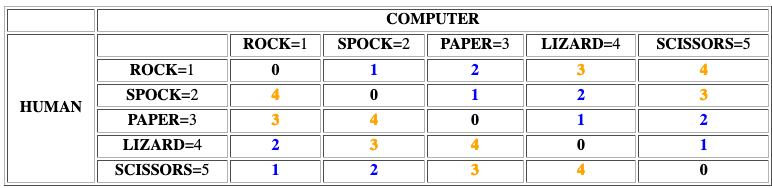
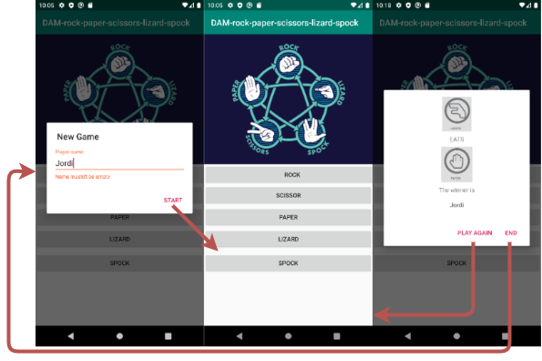
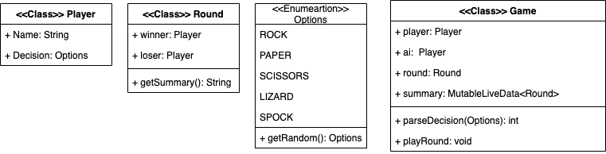
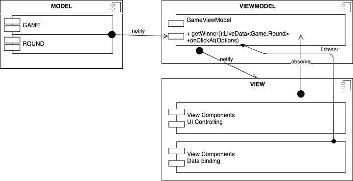

---
title: "AMD-09: Rock-Paper-Scissors-Lizard-Spock"
subtitle: "Applications for mobile devices & Course 2019-2020"
keywords: "lecture, markdown, android, apps"
author: "Jordi Mateo Fornés <jordi.mateo@udl.cat>"
copyright: "(c) 2019-2020 Jordi Mateo Fornés"
license: "MIT"

...

* Dr. Jordi Mateo Fornés
* **Office**:
  * Office A.12 (Campus Igualada)
  * Office 3.08 (EPS Lleida)
* **Email**: jordi.mateo@udl.cat
* Doubts
  * During class
  * After class
  * Email
    * Topic: [AMD]: XXXXXXXXX

Inspiration
---------------

This example was inspired in **[TicTacToe](https://github.com/husaynhakeem/TicTacToe-MVVM)**.

Rock-Paper-Scissors-Lizard-Spock
===================================

Sheldon rules
-------------------

::: center
 ~ The Big Bang Theory ")
:::

Rules
-----------

* Scissors cuts Paper
* Paper covers Rock
* Rock crushes Lizard
* Lizard poisons Spock
* Spock smashes Scissors
* Scissors decapitates Lizard
* Lizard eats Paper
* Paper disproves Spock
* Spock vaporizes Rock
* (and as it always has) Rock crushes Scissors

Compute the winner
---------------------

$$ (player1 - player2 + 5) \% 5$$

:::center

:::

Design
--------

::: columns
::: {.column width="40%"}

* Design all the user interaction in 1 Activity and 2 Dialogs.
* Enter the user name and validate that it is not empty. (*BeginGameDialog*)
* Select the movement (player).
* IA is going to make a random choice.
* Show round results (*EndGameDialog*).
  
:::
::: {.column width="50%"}

:::
:::

UML Design: Models
----------

:::center

:::

UML Design: MVVM
----------

:::center

:::

New Stuff
----------

* **Dialogs**: [Developers](https://developer.android.com/guide/topics/ui/dialogs#java).
* **DataBindings**: [Developers](https://developer.android.com/topic/libraries/data-binding)

That is all
------------------

www   --- [jordimateofornes.com](https://jordimateofornes.com)

github   --- [github.com/JordiMateo](https://github.com/JordiMateo)

twitter   --- [\@MatForJordi](https://twitter.com/MatForJordi)

gdc   --- [Distributed computation group](http://gcd.udl.cat)
