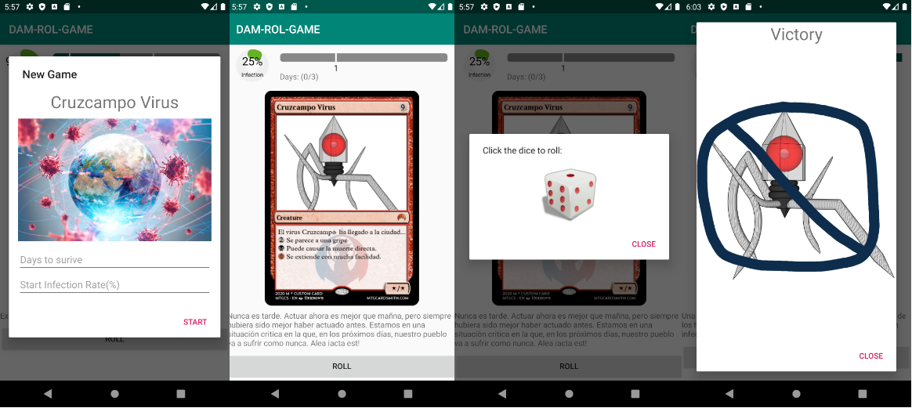

---
title: "AMD-10: Cruzcampo Virus"
subtitle: "Applications for mobile devices & Course 2019-2020"
keywords: "lecture, markdown, android, apps"
author: "Jordi Mateo Fornés <jordi.mateo@udl.cat>"
copyright: "(c) 2019-2020 Jordi Mateo Fornés"
license: "MIT"

...

* Dr. Jordi Mateo Fornés
* **Office**:
  * Office A.12 (Campus Igualada)
  * Office 3.08 (EPS Lleida)
* **Email**: jordi.mateo@udl.cat
* Doubts
  * During class
  * After class
  * Email
    * Topic: [AMD]: XXXXXXXXX

CruzCampo Virus
===============

Context of the Game
---------

* We want to _survive_ **{X}** _days_ to the infection of the virus. _Infection_ can not achieve **100\%**.

* We _start_ with a predefined **infection rate (%)**.
  
* Each day a new event happens. Maybe a good event to reduce the progress of the virus or a bad event to increase it.

Screenshots
---------

:::center

:::

Initial Configuration
----------------------

* Edit build.gradle

```java
compileOptions {
        targetCompatibility JavaVersion.VERSION_1_8
        sourceCompatibility JavaVersion.VERSION_1_8
    }
```

Dice Model
===================

Step 1: Main Activity
-------------------

* Implementation of **Main activity** with a single button (_rollDiceButton_).
* Implement _onClick_ to open a new dialog.

```java
roll.setOnClickListener(new View.OnClickListener() {
  @Override
  public void onClick(View v) {
    DiceDialog dialog = DiceDialog.newInstance(MainActivity.this);
    dialog.show(getSupportFragmentManager(),DICE_DIALOG_TAG);
    }
  });
```

Step 2: Dice Dialog ViewModel
-------------------------------

* The logic of a normal dice is obtaining a random number between 1 and 6.

```java
void roll(){
  int cValue = rnd.nextInt(6) + 1;
  imageRes.setValue(getDiceResource(cValue));
}
```

* Every time the user rolls the dice the view must be refreshed with the corresponding image of the number.
  
```java
public MutableLiveData<Integer> imageRes;
```

Step 3: Dice 3d model
-----------------------

* We need to draw and model the images corresponding to the dice before rolling and after rolling to show the obtained number.

* Luckily, we can obtain these resources from [Dice Model](https://tekeye.uk/free_resources/android/launcher-icons/dice_resources.zip).

* We are going to copy all the contents into folder: _drawable_.

Step 4: Dice Dialog ModelView
------------------------------

```java
private int getDiceResource(int dice){
  switch(dice) {
      case 1: return R.drawable.one;
      case 2: return R.drawable.two;
      case 3: return R.drawable.three;
      case 4: return R.drawable.four;
      case 5: return R.drawable.five;
      case 6: return R.drawable.six;
      default: return -1;
      }
    }
```

Step 5: Dice Dialog Layout
------------------------------

* Simple design with only an _ImageView_. This component is going to gather the user click and start the rolling step and after that is going to show the final result. (_dice_dialog.xml_)

```java
<ImageView
  android:id="@+id/imageView"
  android:layout_width="131dp"android:layout_height="121dp"
  app:layout_constraintBottom_toBottomOf="parent"
  app:layout_constraintEnd_toEndOf="parent"
  app:layout_constraintStart_toStartOf="parent"
  app:layout_constraintTop_toTopOf="parent"
  app:layout_constraintVertical_bias="0.295"
  app:srcCompat="@drawable/dice3d"
  android:contentDescription="@string/game_dice" />
```

Step 6: Dice Dialog View - _onCreateDialog_
--------------------------------------------

```java
@NonNull
@Override
public Dialog onCreateDialog(Bundle savedInstanceState) {
  initView();
  AlertDialog alertDialog = new AlertDialog.Builder(getContext())
      .setView(rootView)
      .setCancelable(true)
      .setMessage(R.string.start_dice)
      .setPositiveButton(R.string.close, null)
      .create();
  alertDialog.setCanceledOnTouchOutside(false);
  return alertDialog;
}
```

Step 6: Dice Dialog View - Strings
--------------------------------------------

* **R.string.start_dice**: "Click here to roll the dice"
* **R.string.close**: "Close".

Step 7: Dice Dialog View - _Observe LiveData_
--------------------------------------------

```java
 public void initView(){
  rootView = LayoutInflater.from
  (getContext()).inflate(R.layout.dice, null, false);
  dice_picture = (ImageView) rootView.findViewById(R.id.imageView);

  diceViewModel = new DiceViewModel();
  diceViewModel.imageRes.observe(this, new Observer<Integer>() {
    @Override
    public void onChanged(Integer value) {
      dice_picture.setImageResource(value);
    }
  });  
 }
```

Step 8: Dice Dialog View - Animation
--------------------------------------------

* We are going to simulate the dice rolling using simple animation. We need 4 things:
  * A handler instance to manage the animation and show the value to the user after the animation.
  * A timer to control the end of the animation (**delay**).
  * A boolean to control the state of the dice.
  * A RotateAnimation instance.

```java
  Handler handler;
  Timer timer=new Timer();
  boolean rolling=false;
  RotateAnimation rotate;
```

Step 8: Dice Dialog View - Animation Config
--------------------------------------------

```java
// add this to initView()
dice_picture.setOnClickListener(new HandleClick());
rotate = new RotateAnimation(0, 360,
Animation.RELATIVE_TO_SELF, 0.5f,
Animation.RELATIVE_TO_SELF, 0.5f);
rotate.setDuration(3000);
rotate.setInterpolator(new LinearInterpolator());
handler=new Handler(callback);
```

Step 9: Dice Dialog View - Animation Handler
--------------------------------------------

```java
private class HandleClick implements View.OnClickListener {
  public void onClick(View arg0) {
    if (!rolling) {
      rolling = true;
      dice_picture.setImageResource(R.drawable.dice3d);
      dice_picture.startAnimation(rotate);
      timer.schedule(new Roll(), 3000);
    }
  }
}
```

Step 9: Dice Dialog View - Animation Handler Callback
--------------------------------------------

```java
Handler.Callback callback = new Handler.Callback() {
  public boolean handleMessage(Message msg) {
    diceViewModel.roll();
    rolling=false;
    rotate.cancel();
    return true;
  }
};
```

Step 10: Dice Dialog View - Timer
--------------------------------------------

```java
class Roll extends TimerTask {
  public void run() {
    handler.sendEmptyMessage(0);
  }
}
```

Dice Model: Summary
--------------------------------------------

::: columns
::: {.column width="60%"}

* At this point, we have a MainActivity that opens a dialog. This dialog simulates dice rolling rounds. Try it!

:::
::: {.column width="40%"}


:::
:::

Game Model
===================

Step 1: Game Events
------------------------

* For a sake of simplicity, all the events will have the same probability.
* We are going to create 6 events to associate with the dice values.

```java
public enum Events {
    REPARTO,
    VACUNAS,
    ENCASA,
    FUERACASA,
    CEPAMUTADA,
    INCONCIENCIA;
    public static Events getRandomEvent() {
        Random random = new Random();
        return values()[random.nextInt(values().length)];
    }
}
```

Step 2: Game Events - Model the events
-----------------------------------------

```java
public static int getMessageResource(Events e){
switch(e){
  case REPARTO: return R.string.REPARTO;
  case ENCASA: return R.string.ENCASA;
  case VACUNAS: return R.string.VACUNAS;
  case FUERACASA: return R.string.FUERACASA;
  case CEPAMUTADA: return R.string.CEPAMUTADA;
  case INCONCIENCIA: return R.string.INCONCIENCIA;
  default: return -1;
  }
}
```

Step 3: Game Events - Design the events
-----------------------------------------

* Write the explanation to each event in _strings.xml_.
  
* To make the game more visual attractive I designed the card using this magic card generator, be original and use your design. Use it here [Card Generator](http://mtgcardsmith.com/mtg-card-maker/)

* ... or use my designs that are uploaded in the CV.

* Put them into _drawable_ folder.

Step 3: Game Events - Associate cards with Events
-----------------------------------------

```java
public static int getCardResource(Events e){
  switch(e){
    case REPARTO: return R.drawable.reparto;
    case ENCASA: return R.drawable.casa;
    case VACUNAS: return R.drawable.vacunas;
    case FUERACASA: return R.drawable.fuera;
    case CEPAMUTADA: return R.drawable.cepa;
    case INCONCIENCIA: return R.drawable.inconcienca;
    default: return -1;
    }
  }
```

Step 4: Game Events - Associate cards with Damage
-----------------------------------------

```java
public static int getCardResource(Events e){
  switch(e){
    case REPARTO: return -(random.nextInt((5 - 1) +1 ) + 1);
    case ENCASA: return -5;
    case VACUNAS: return -(random.nextInt((20 - 10) +1 ) + 10);
    case FUERACASA: return 15;
    case CEPAMUTADA: return 25;
    case INCONCIENCIA: return (random.nextInt((70 - 60) +1 ) + 60);
    default: return -1;
  }
```

Step 5: Game Model
-----------------------------------------

* Amount of days to survive.
* Current ratio of infection.
* Current event.
* Current day.
* Current game status.

**What will produce changes in our view?**

Step 6: Game Model
-----------------------------------------

* Amount of days to survive.
* **Current ratio of infection.**
* **Current event.**
* **Current day.**
* **Current game status.**

```java
    private MutableLiveData<Integer> infection;
    private MutableLiveData<Boolean>  survival;
    private MutableLiveData<Events> roundEvent;
    private MutableLiveData<Integer> cDay;
    private int days;
```

Step 7: Game constructor
-------------------------

```java
public Game(MutableLiveData<Events> cEvent,MutableLiveData<Integer> cInfection,
MutableLiveData<Integer> cDay, MutableLiveData<Boolean> survive,
int days,int infectionRate){
  this.days = days;
  infection = cInfection;
  infection.setValue(infectionRate);
  survival = survive;
  this.cDay = cDay;
  this.cDay.setValue(0);
  roundEvent = cEvent;
}
```

Step 8: Game Round (1)
-----------------------------------------

```java
public void round(int diceValue){

  int day = 0;
  if ( cDay.getValue() != null){
    day = cDay.getValue() + 1; cDay.setValue(day);
  }

  Events cEvent = parseDiceToEvent(diceValue);
  roundEvent.setValue(cEvent);
  int cValue = Events.getEventDamage(cEvent
  != null ? cEvent : Events.INCONCIENCIA);

```

Step 8: Game Round (2)
-----------------------------------------

```java

  int cSurvival = 0;
  if (infection.getValue() != null){
    cSurvival = infection.getValue() + cValue;
    if (cSurvival < 0){cSurvival = 0;}
    infection.setValue(cSurvival);
  }
  hasEnd(cSurvival,day);
}
```

Step 9: Game End
-----------------------------------------

```java
private void hasEnd(int cValue, int cDay){

  if (cDay == days && cValue < 100){
    survival.setValue(true);
  }

  if (cValue >= 100){
    survival.setValue(false);
  }

}
```

Step 10: Game _getEventFromDice_
-----------------------------------------

```java
private Events parseDiceToEvent(int diceValue){
  switch (diceValue){
    case 1: return Events.REPARTO;
    case 2: return Events.VACUNAS;
    case 3: return Events.ENCASA;
    case 4: return Events.FUERACASA;
    case 5: return Events.CEPAMUTADA;
    case 6: return Events.INCONSIENCIA;
    default: return null;
  }
}
```

Game Start Dialog
===================

Game Start Dialog
--------------------------------------------

::: columns
::: {.column width="60%"}

* We need to obtain the game configuration: the number of days to survive and the initial infection rate.

:::
::: {.column width="40%"}


:::
:::

Step 1: _Linear Layout_ (1)
-------------------

```java
<TextView
  android:id="@+id/game_status_msg"
  android:layout_width="match_parent"
  android:layout_height="wrap_content"
  android:gravity="clip_horizontal|center"
  android:text="@string/game_name"
  android:textSize="30sp" />
```

Step 1: _Linear Layout_ (2)
-------------------

```java
<ImageView
  android:id="@+id/game_logo"
  android:layout_width="wrap_content"
  android:layout_height="241dp"
  app:srcCompat="@drawable/pandemia"
  android:contentDescription="@string/game_name" />
```

Step 1: _Linear Layout_ (3)
-------------------

```java
<EditText
  android:id="@+id/days_survive_input"
  android:layout_width="match_parent"
  android:layout_height="wrap_content"
  android:ems="10"
  android:hint="@string/days_to_surive"
  android:inputType="numberSigned"
  android:importantForAutofill="no" />
```

Step 1: _Linear Layout_ (4)
-------------------

```java
<EditText
  android:id="@+id/infection_rate_input"
  android:layout_width="match_parent"
  android:layout_height="wrap_content"
  android:ems="10"
  android:hint="@string/start_infection_rate"
  android:inputType="numberSigned"
  android:importantForAutofill="no" />
```

Step 4: GameBegin Dialog (1)
---------------------------

```java
private View rootView;
private MainActivity activity;
private TextView daysEditText;
private TextView survivalEditText;

public static GameBeginDialog newInstance(MainActivity activity) {
  GameBeginDialog dialog = new GameBeginDialog();
  dialog.activity = activity;
  return dialog;
}
```

Step 4: GameBegin Dialog (2)
---------------------------

```java
@NonNull
@Override
public Dialog onCreateDialog(Bundle savedInstanceState) {
  initViews();
  AlertDialog alertDialog = new AlertDialog.Builder(getContext())
    .setView(rootView)
    .setTitle(R.string.game_dialog_title)
    .setCancelable(false)
    .setPositiveButton(R.string.start, null)
    .create();
}
```

Step 4: GameBegin Dialog (3)
---------------------------

```java
  alertDialog.setCanceledOnTouchOutside(false);
  alertDialog.setCancelable(false);
  alertDialog.setOnShowListener(dialog -> {
    onDialogShow(alertDialog);
  });
  return alertDialog;
}
```

Step 5: GameBegin Dialog _init_
---------------------------

```java
private void initViews() {
  rootView = LayoutInflater.from(getContext())
  .inflate(R.layout.game_begin_dialog, null, false);

  daysEditText = (EditText)
  rootView.findViewById(R.id.days_survive_input);
  survivalEditText = (EditText)
  rootView.findViewById(R.id.infection_rate_input);
}
```

Step 6: GameBegin Dialog _onDialogShow_
---------------------------

```java
private void onDialogShow(AlertDialog dialog) {
  Button positiveButton = 
  dialog.getButton(AlertDialog.BUTTON_POSITIVE);
  positiveButton.setOnClickListener(v -> {
    onDoneClicked();
  });
}
```

Step 7: GameBegin Dialog _onDoneClicked_
---------------------------

```java
private void onDoneClicked() {
  int days = 7; int survival_rate= 50;
  String cdays = daysEditText.getText().toString();
  String csurvival_rate = survivalEditText.getText().toString();
  if (!"".equals(cdays)){
    days=Integer.parseInt(cdays);
  }
  if (!"".equals(csurvival_rate)){
    survival_rate=Integer.parseInt(csurvival_rate);
  }
  activity.startGame(days, survival_rate);
  dismiss();
}
```

Game ViewModel
==============

Step 1: Game ViewModel
-----------------------

* We need to gather the changes during the game rounds and notify the view to update UI components such as the progress bar (how many days last to survive, or current infection status).

```java
private MutableLiveData<Events> cEvent;
private MutableLiveData<Integer> cInfection;
private MutableLiveData<Boolean> survive;
private MutableLiveData<Integer> cDay;
private Game game;
```

Step 2: Game ViewModel constructor
-----------------------

```java
cEvent = new MutableLiveData<>();
cInfection = new MutableLiveData<>();
survive = new MutableLiveData<>();
cDay = new MutableLiveData<>();
game = new Game(cEvent, cInfection,cDay,survive, days,
survival_rate);
```

Step 3: Game ViewModel methods
-----------------------

```java
public  MutableLiveData<Events> getEvent(){return cEvent;}
public  MutableLiveData<Integer>  getInfection()
{return cInfection;}
public  MutableLiveData<Boolean> getSurvival(){return survive;}
public  MutableLiveData<Integer>  getDay(){return cDay;}
public int getDays(){return game.getDays();}
public void play(int diceValue){game.round(diceValue);}
```

GameActivity
============

Step 1: GameActivity = MainActivity
--------------------------------------------

::: columns
::: {.column width="60%"}

* We **kept** the button to roll the dice.
* We are going to **reuse** our current MainActivity.
* We are going to **add** a _progress bar_. (% infection).
* We are going to **add** a _seek bar_. (days to finish).
* We are going to **add** the _image_ of the current event (card).
* We are going to **add** the text to _explain_ the current _event_.

:::
::: {.column width="40%"}


:::
:::

Step 2: Add external dependencies
-----------------------------------

* Update build.gradle

```java
implementation 'com.zekapp.library:progreswheelview:1.1.5'
implementation 'com.params.progressview:step-progress:1.0.2'
```

Step 3: Main Activity _Constraint Layout_ (1)
-----------------------------------

```java
<ImageView
  android:id="@+id/card"
  android:layout_width="406dp"
  android:layout_height="386dp"
  android:layout_marginTop="8dp"
  app:layout_constraintEnd_toEndOf="parent"
  app:layout_constraintHorizontal_bias="0.4"
  app:layout_constraintStart_toStartOf="parent"
  app:layout_constraintTop_toBottomOf="@+id/infection_progress"
  app:srcCompat="@drawable/virus" />
```

Step 3: Main Activity _Constraint Layout_ (2)
-----------------------------------

```java
<Button
  android:id="@+id/roll"
  android:layout_width="411dp"
  android:layout_height="wrap_content"
  android:layout_marginTop="8dp"
  android:text="@string/roll"
  app:layout_constraintEnd_toEndOf="parent"
  app:layout_constraintHorizontal_bias="0.0"
  app:layout_constraintStart_toStartOf="parent"
  app:layout_constraintTop_toBottomOf="@+id/textView3" />
```

Step 3: Main Activity _Constraint Layout_ (3)
-----------------------------------

```java
<TextView
        android:id="@+id/textView2"
        android:layout_width="wrap_content"
        android:layout_height="wrap_content"
        android:text="Day: (0/7)"
        app:layout_constraintEnd_toEndOf="parent"
        app:layout_constraintHorizontal_bias="0.017"
        app:layout_constraintStart_toEndOf=
        "@+id/infection_progress"
        app:layout_constraintTop_toBottomOf="@+id/stepProgressView" />
```

Step 3: Main Activity _Constraint Layout_ (4)
-----------------------------------

```java
<TextView
        android:id="@+id/textView3"
        android:layout_width="411dp"
        android:layout_height="wrap_content"
        android:layout_marginTop="8dp"
        android:text="Explain the event"
        app:layout_constraintStart_toStartOf="parent"
        app:layout_constraintTop_toBottomOf="@+id/card" />
```

Step 3: Main Activity _Constraint Layout_ (5)
-----------------------------------

```java
<params.com.stepprogressview.StepProgressView
  android:id="@+id/stepProgressView"
  android:layout_width="300dp"
  android:layout_height="wrap_content"
  android:layout_marginTop="16dp"
  app:currentProgress="40"
  app:layout_constraintEnd_toEndOf="parent"
  app:layout_constraintHorizontal_bias="0.238"
  app:layout_constraintStart_toEndOf="@+id/infection_progress"
```

Step 3: Main Activity _Constraint Layout_ (6)
-----------------------------------

```java
  app:layout_constraintTop_toTopOf="parent"
  app:markerColor="@android:color/white"
  app:markerWidth="3dp"
  app:markers="10,60,120"
  app:progressColor="@color/colorPrimaryDark"
  app:textMargin="5dp"
  app:textSize="15sp"
  app:totalProgress="100" />
```

Step 3: Main Activity _Constraint Layout_ (7)
-----------------------------------

```java
<com.app.progresviews.ProgressWheel
  android:id="@+id/infection_progress"
  android:layout_width="90dp"
  android:layout_height="75dp"
  app:barWidth="17dp"
  app:countText="931,199"
  app:countTextColor="@android:color/black"
  app:countTextSize="20sp"
```

Step 3: Main Activity _Constraint Layout_ (8)
-----------------------------------

```java
  app:defTextColor="@android:color/black"
  app:defTextSize="10sp"
  app:definitionText="Steps"
  app:layout_constraintStart_toStartOf="parent"
  app:layout_constraintTop_toTopOf="parent"
  app:marginBtwText="15dp"
  app:percentage="90"
  app:progressColor="#64b324" />
```

Step 4: Main Activity _View_
-------------------------------

```java
private static final String 
GAME_BEGIN_DIALOG_TAG = "game_dialog_tag";
private static final String 
GAME_END_DIALOG_TAG = "game_end_dialog_tag";
private GameViewModel gameViewModel;
private TextView daysTextView;
private TextView eventTextView;
private ImageView cardImageView;
private StepProgressView gameProgress;
private ProgressWheel gameInfectionProgress;
```

Step 5: Main Activity _onCreate_
-------------------------------

```java
daysTextView = findViewById(R.id.textView2);
eventTextView = findViewById(R.id.textView3);
cardImageView = findViewById(R.id.card);
gameProgress = findViewById(R.id.stepProgressView);
gameInfectionProgress = findViewById(R.id.infection_progress);
...
promptForConfiguration();
```

Step 6: Main Activity _promptForConfiguration_
-------------------------------

```java
public void promptForConfiguration(){
  GameBeginDialog dialog = GameBeginDialog.newInstance(this);
  dialog.setCancelable(false);
  dialog.show(getSupportFragmentManager(), GAME_BEGIN_DIALOG_TAG);
}
```

Step 7: Main Activity _startGame_ (1)
-------------------------------

* We need to create the game and introduce the event 0.
* Event 0 must introduce game situations.

```java
public void startGame(int days, int survival_rate){
  gameViewModel = new GameViewModel(days, survival_rate);
  eventTextView.setText(getText(R.string.EMPIEZA));
  ardImageView.setImageResource(R.drawable.virus);
  gameProgress.setCurrentProgress(0);
}
```

Step 7: Main Activity _startGame_ (2)
-------------------------------

* We need to reset visual components.

```java
ArrayList<Integer> markers = new ArrayList<>();
markers.add(gameViewModel.getDays()/2);
gameProgress.setMarkers(markers);
gameProgress.setTotalProgress(gameViewModel.getDays());

gameInfectionProgress.setDefText("Infection");
gameInfectionProgress
.setStepCountText(survival_rate + "%");
gameInfectionProgress.setPercentage(survival_rate);
```

Step 7: Main Activity _startGame_ (3)
-------------------------------

```java
gameViewModel.getEvent().observe(this, new Observer<Events>() {
@Override
  public void onChanged(Events e) {
    int msgRes = Events.getMessageResource(e);
    int imgRes = Events.getCardResource(e);
    eventTextView.setText(getText(msgRes));
    cardImageView.setImageResource(imgRes);
  }
});
```

Step 7: Main Activity _startGame_ (4)
-------------------------------

```java
gameViewModel.getInfection().observe(this, new Observer<Integer>() {
  @Override
  public void onChanged(Integer i) {
    gameInfectionProgress.setStepCountText(i + "%");
    gameInfectionProgress.setPercentage(i);
  }
});
```

Step 7: Main Activity _startGame_ (5)
-------------------------------

```java
gameViewModel.getDay().observe(this, new Observer<Integer>(){
  @Override
  public void onChanged(Integer i) {
    String msg = "Days: (" + i + "/" + gameViewModel.getDays() + ")";
    daysTextView.setText(msg);
    gameProgress.setCurrentProgress(i);
  }
});
```

Step 7: Main Activity _startGame_ (6)
-------------------------------

```java
gameViewModel.getSurvival().observe(this, new Observer<Boolean>() {
  @Override
  public void onChanged(Boolean survive) {
    GameEndDialog dialog =
    GameEndDialog.newInstance(MainActivity.this, survive);
    dialog.show(getSupportFragmentManager(), "Gam");
    }
});
```

GameEndDialog
=============

GameEnd Dialog
--------------------------------------------

::: columns
::: {.column width="40%"}

:::center

:::

:::
::: {.column width="40%"}

:::center

:::

:::
:::

Step 1: GameEndDialog _Linear Layout_ (1)
--------------------------------

```java
 <TextView
    android:id="@+id/game_status_msg"
    android:layout_width="match_parent"
    android:layout_height="wrap_content"
    android:gravity="clip_horizontal|center"
    android:text="VICTORY"
    android:textSize="30sp" />
```

Step 1: GameEndDialog _Linear Layout_ (2)
--------------------------------

```java
 <ImageView
        android:id="@+id/game_status_img"
        android:layout_width="match_parent"
        android:layout_height="match_parent"
        app:srcCompat="@drawable/victory" />
```

Step 2: GameEndDialog _Components_
--------------------------------

```java
private View rootView;
private MainActivity activity;
private boolean survive;

public static GameEndDialog newInstance(
  MainActivity activity, Boolean survive) {
    GameEndDialog dialog = new GameEndDialog();
    dialog.activity = activity;
    dialog.survive = survive;
    return dialog;
}
```

Step 2: GameEndDialog _onCreate_
--------------------------------

```java
@NonNull @Override
public Dialog onCreateDialog(Bundle savedInstanceState) {
  initViews();
  AlertDialog alertDialog = new AlertDialog.Builder(getContext())
    .setView(rootView)
    .setCancelable(false)
    .setPositiveButton(R.string.close,
    ((dialog, which) -> onNewGame()))
    .create();
  alertDialog.setCanceledOnTouchOutside(false);
  alertDialog.setCancelable(false);
  return alertDialog;
}
```

Step 3: GameEndDialog _initView_ (1)
--------------------------------

```java
private void initViews() {
  rootView = LayoutInflater.from(getContext())
  .inflate(R.layout.game_end_dialog, null, false);

  if (survive){
    ((TextView) rootView.findViewById
    (R.id.game_status_msg)).setText("Victory");

    ((ImageView) rootView.findViewById
    (R.id.game_status_img))
    .setImageResource(R.drawable.victory);
  }
```

Step 3: GameEndDialog _initView_ (2)
--------------------------------

```java
  else{
    ((TextView) rootView.
    findViewById(R.id.game_status_msg)).setText("Defeat");
    ((ImageView) rootView.findViewById(R.id.game_status_img))
    .setImageResource(R.drawable.defeat);
    }
  }
```

Step 3: GameEndDialog Retry.Play Again
--------------------------------

```java
private void onNewGame() {
  activity.promptForConfiguration();
  dismiss();
}
```

Improvements and Challenges
====

Play it
--------

* Rock and roll and play with this game.
* Define your own rules.
* Use more than one dice and increase the game logic complexity.

That is all
------------------

Well done! We implement the Cruzcampo Virus!!!

www   --- [jordimateofornes.com](https://jordimateofornes.com)

github   --- [github.com/JordiMateo](https://github.com/JordiMateo)

twitter   --- [\@MatForJordi](https://twitter.com/MatForJordi)

gdc   --- [Distributed computation group](http://gcd.udl.cat)
