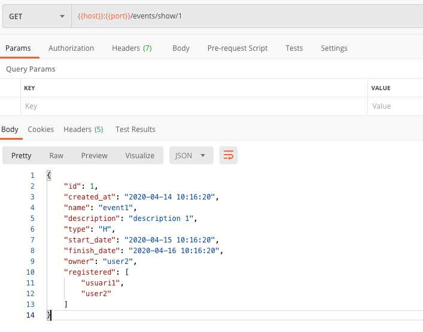
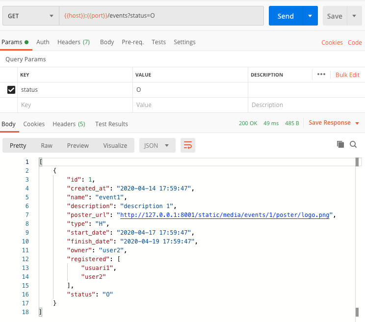
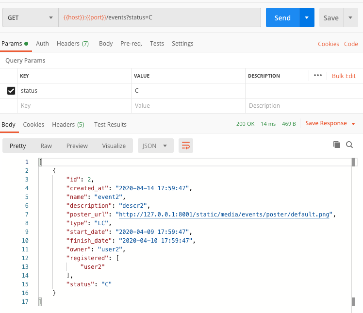
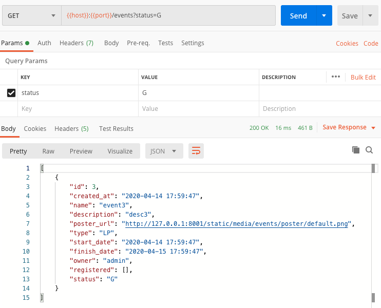

---
title: "DAM: Using SqlAlchemy in Falcon API"
subtitle: "Applications for mobile devices & Course 2019-2020"
keywords: "lecture, markdown, android, apps"
author: "Jordi Mateo Fornés <jordi.mateo@udl.cat>"
copyright: "(c) 2019-2020 Jordi Mateo Fornés"
license: "MIT"
...

Presentation
-------------

::: columns
::: {.column width="30%"}

::: center

:::

:::
::: {.column width="60%"}

* Dr. Jordi Mateo Fornés
* **Office**:
  * Office A.12 (Campus Igualada)
  * Office 3.08 (EPS Lleida)
* **Email**: jordi.mateo@udl.cat
* **Twitter**: [https://twitter.com/MatForJordi](https://twitter.com/MatForJordi)
* **Github**: [https://github/JordiMateoUdL](https://github.com/JordiMateoUdL/)

:::
:::

Course
-------

::: columns
::: {.column width="30%"}
::: center


:::
:::
::: {.column width="60%"}
:::center

* **Applications for mobile devices**.
* [Grau en Tècniques d'Interacció Digital i de Computació](http://www.grauinteraccioicomputacio.udl.cat/ca/index.html)
* [Campus Igualada](http://www.campusigualada.udl.cat/ca/) - [Escola Politècnica Superior](http://www.eps.udl.cat/ca/) - [Universitat de Lleida](http://www.udl.cat/ca/)
* All the code developed in this course can be found in this repository: [DAM Course](https://github.com/JordiMateoUdL/Development-of-Mobile-Applications).

:::
:::
:::

Agenda
------

* Introduction to _SqlAlchemy_
* **HandsOn**: (DamCore - Events)
* **HandsOn**: (DamCore - Serving Static Content)
* **HandsOn**: (DamCore - Filtering)
* AC-04

Introduction to SqlAlchemy
=======================

What is SqlAlchemy
-------------------

**SQLAlchemy** is the Python _SQL toolkit_ and _Object Relational Mapper_ that gives application developers the full power and flexibility of **SQL**.

It provides a full suite of well known enterprise-level persistence patterns, designed for efficient and high-performing database access, adapted into a simple and _Pythonic_ domain language.

Basic Relationship Patterns
---------------------------

* One to many
* Many to one
* One to one
* Many to many

::: center
Information extracted from SqlAlchemy Documentation, check it **[SqlAlchemy Docs](
https://docs.sqlalchemy.org/en/13/orm/basic_relationships.html#one-to-many)**.
:::

One to Many
-----------

```python
class Parent(Base):
    __tablename__ = 'parent'
    id = Column(Integer, primary_key=True)
    children = relationship("Child")

class Child(Base):
    __tablename__ = 'child'
    id = Column(Integer, primary_key=True)
    parent_id = Column(Integer, ForeignKey('parent.id'))
```

Many to One
----------

```python
class Parent(Base):
    __tablename__ = 'parent'
    id = Column(Integer, primary_key=True)
    child_id = Column(Integer, ForeignKey('child.id'))
    child = relationship("Child", back_populates="parents")

class Child(Base):
    __tablename__ = 'child'
    id = Column(Integer, primary_key=True)
    parents = relationship("Parent", back_populates="child")
```

One to One
----------

```python
class Parent(Base):
    __tablename__ = 'parent'
    id = Column(Integer, primary_key=True)
    child = relationship("Child", uselist=False,
    back_populates="parent")

class Child(Base):
    __tablename__ = 'child'
    id = Column(Integer, primary_key=True)
    parent_id = Column(Integer, ForeignKey('parent.id'))
    parent = relationship("Parent", back_populates="child")
```

Many to many - Association
-------------------------

```python
association_table = Table('association', Base.metadata,
    Column('left_id', Integer, ForeignKey('left.id')),
    Column('right_id', Integer, ForeignKey('right.id'))
)
```

Many to many
------------

```python
class Parent(Base):
    __tablename__ = 'left'
    id = Column(Integer, primary_key=True)
    children = relationship("Child",
                    secondary=association_table)

class Child(Base):
    __tablename__ = 'right'
    id = Column(Integer, primary_key=True)
```

HandsOn(DamCore - Events)
=========================

HandsOn(DamCore - Events) -  Goals
-----------------------------------

* Create a new data model, an event.
* Store them in the database.
* Create the following relations:
  * An event can be only created by **a** user. But a user can create **1 or more** events. _(Relation One to Many)_.
  * A user can be enrolled with **0 or N** events, and also an event can have **0 or M** registered users. _(Relation Many to Many)_.

HandsOn(DamCore - Events) -  Model 1
-----------------------------------

* We are going to define 3 types of events using an enum.
  
```python
class EventTypeEnum(enum.Enum):
    hackathon = "H"
    lanparty = "LP"
    livecoding = "LC"
```

HandsOn(DamCore - Events) -  Model 2
-----------------------------------

* Basic features of the events:

```python
  id = Column(Integer, primary_key=True)
  created_at = Column(DateTime, default=datetime.datetime.now,
  nullable=False)
  name = Column(Unicode(255), nullable=False)
  description = Column(UnicodeText)
  type = Column(Enum(EventTypeEnum))
  start_date = Column(DateTime, nullable=False)
  finish_date = Column(DateTime, nullable=False)
```

HandsOn(DamCore - Events) -  Relation (One to Many)
---------------------------------------------------

```python
class Event(SQLAlchemyBase, JSONModel):
    __tablename__ = "events"
    ...
    owner_id = Column(Integer,
      ForeignKey("users.id"), nullable=False)
    owner = relationship("User", back_populates="events_owner")
    ...
```

```python
class User(SQLAlchemyBase, JSONModel):
    __tablename__ = "users"
    ...
    events_owner = relationship("Event", back_populates="owner")
    ...
```

HandsOn(DamCore - Events) -  Relation (One to Many) - back_populates, backref
----------------------------------------------------------------------------

To tell _Sqlalchemy_  that two fields are related. Use **back_populates** if you want to define the relationships on every class (cleaner option). If not you can also use  **backref**.

**back_populates** has the same meaning as backref, except that the complementing relationship property is not created automatically. So using **back_populates** makes the model code more explicit, with no _hidden/implicit_ properties.

HandsOn(DamCore - Events) -  Relation (One to Many) - DELETE ISSUE
----------------------------------------------------------------------------

* Now, to delete a user, first I need all the events owned by this user, or change ownership. Because, if I try to delete, I will see:

```sql
Cannot delete or update a parent row: a foreign key constraint
fails (`dev-test`.`events`, CONSTRAINT `events_ibfk_1`
FOREIGN KEY (`owner_id`) REFERENCES `users` (`id`))
12:55:24 Ordre SQL
```

HandsOn(DamCore - Events) -  Relation (One to Many) - DELETE ISSUE SOLUTION
----------------------------------------------------------------------------

The **delete cascade** indicates that when a “parent” object is marked for deletion, its related “child” objects should also be marked for deletion. Delete cascade is more often than not used in conjunction with **delete-orphan** cascade, which will emit a _DELETE_ for the related row if the “child” object is deassociated from the parent.

The **combination** of **delete and delete-orphan cascade** _covers_ both situations where _SQLAlchemy_ has to _decide between_ settings a foreign key column to _NULL_ versus _deleting the row entirely_.

HandsOn(DamCore - Events) -  Relation (One to Many) - Final
-----------------------------------------------------------

```python
class Event(SQLAlchemyBase, JSONModel):
    __tablename__ = "events"
    owner_id = Column(Integer,
      ForeignKey("users.id", onupdate="CASCADE",
      ondelete="CASCADE"), nullable=False)
    owner = relationship("User", back_populates="events_owner")
```

```python
class User(SQLAlchemyBase, JSONModel):
    __tablename__ = "users"
    events_owner = relationship("Event", back_populates="owner",
    cascade="all, delete-orphan")
```

HandsOn(DamCore - Events) -  Relation (Many to Many) - Association
-----------------------------------------------------------------

```python
# file: db/models.py
EventParticipantsAssociation =
  Table("event_participants_association",
  SQLAlchemyBase.metadata,
      Column( "event_id", Integer,
        ForeignKey("events.id", onupdate="CASCADE",
        ondelete="CASCADE"),nullable=False),
      Column("user_id", Integer,
        ForeignKey("users.id", onupdate="CASCADE",
        ondelete="CASCADE"),nullable=False),
    )
```

HandsOn(DamCore - Events) -  Relation (Many to Many)
------------------------------------------------------

```python
# file: db/models.py
class Event(SQLAlchemyBase, JSONModel):
    __tablename__ = "events"
    registered = relationship("User",
    secondary=EventParticipantsAssociation,
    back_populates="events_enrolled")
```

```python
# file: db/models.py
class User(SQLAlchemyBase, JSONModel):
    __tablename__ = "users"
    events_enrolled = relationship("Event",
    back_populates="registered")
```

HandsOn(DamCore - Events) -  Reset database script
---------------------------------------------------

* Init some events, for example:

```python
# file: dev/reset_database.py
day_period = datetime.timedelta(days=1)
event_hackatoon = Event(
  created_at=datetime.datetime.now(),
  name="event1",
  description="description 1",
  type=EventTypeEnum.hackathon,
  start_date=datetime.datetime.now() + day_period,
  finish_date=datetime.datetime.now() + (day_period * 2),
  owner_id = 0,
  registered=[user_1, user_2]
)
```

HandsOn(DamCore - Events) -  App routes
---------------------------------------

We are going to create a route to obtain all events in the database and other to see the details of one single event filtered by id property.

```python
# file: app.py
application.add_route("/events",
  event_resources.ResourceGetEvents())
application.add_route("/events/show/{id:int}",
  event_resources.ResourceGetEvent())
```

HandsOn(DamCore - Events) -  ResourceGetEvents()
-----------------------------------------------

```python
# file: resources/event_resource.py
class ResourceGetEvents(DAMCoreResource):
    def on_get(self, req, resp, *args, **kwargs):
      super(ResourceGetEvents, self)
        .on_get(req, resp, *args, **kwargs)
      response_events = list()
      aux_events = self.db_session.query(Event)
      if aux_events is not None:
        for current_event in aux_events.all():
          response_events.append(current_event.json_model)
        resp.media = response_events
        resp.status = falcon.HTTP_200
```

HandsOn(DamCore - Events) -  ResourceGetEvent()
-----------------------------------------------

```python
class ResourceGetEvent(DAMCoreResource):
  ...
      if "id" in kwargs:
        try:
          response_event = self.db_session.query(Event)
            .filter(Event.id == kwargs["id"]).one()
          resp.media = response_event.json_model
          resp.status = falcon.HTTP_200
        except NoResultFound:
          raise falcon.HTTPBadRequest(
            description=messages.event_doesnt_exist)
        else:
          raise falcon.HTTPMissingParam("id")
```

HandsOn(DamCore - Events) -  Testing - getAllEvents
---------------------------------------------------

::: center
{height="200px"}
:::

HandsOn(DamCore - Events) -  Testing - getEventById
---------------------------------------------------

::: center
{height="200px"}
:::

HandsOn(DamCore - Serving Static Contents)
=========================================

HandsOn(DamCore - Serving Static Contents) - Goals
--------------------------------------------------

* Simulate a container **aimed** to serve _static contents_.
* We are going to use **NGINX**.
* We are going to use this server to exchange pictures.
* We are going to update the **events** model to store a **poster** of each event.

HandsOn(DamCore - Serving Static Contents) - Dockerfile
-------------------------------------------------------

```yml
# docker/docker-compose.yml
static-file-server:
    image: nginx:latest
    ports:
      - 8001:80
    volumes:
      - ../../static/.:/usr/share/nginx/html/static
```

**Notice**: You will need to create the _static_ folder at the correct level. In this folder, **../../static/.** , we will create our static resources structure to serve the requests. We are coping this folder into the default nginx static folder in the container **/usr/share/nginx/html/static**.

**Notice**: We redirect the _container_ port **80** (nginx default) to _localhost_ **8001**.

HandsOn(DamCore - Serving Static Contents) - Files
---------------------------------------------------

* We are going to create a rule to store our static content (images), using this pattern:

:::center

```sh
${Host}:8001/${static_folder}/${media_folder}
  /${resource-url}/${image}
```

:::

* Example: We want the picture of the user

:::center

```sh
http://localhost:8001/static/media/users/user2/photo/image.png
```

:::

HandsOn(DamCore - Serving Static Contents) - Pattern Implementation (models.py) (1)
-----------------------------------------------------------

```python
def _generate_media_url(class_instance,
     class_attibute_name, default_image=False):
    class_base_url = urljoin(
      urljoin(urljoin("http://{}"
        .format(settings.STATIC_HOSTNAME),
                settings.STATIC_URL),
                settings.MEDIA_PREFIX),
      class_instance.__tablename__ + "/"
    )
    class_attribute = getattr(class_instance,
            class_attibute_name)
```

HandsOn(DamCore - Serving Static Contents) - Pattern Implementation (models.py) (2)
-----------------------------------------------------------

```python
if class_attribute is not None:
  return urljoin(urljoin(urljoin(urljoin(
    class_base_urlclass_attribute),
    str(class_instance.id) + "/"),
    class_attibute_name + "/"),
    class_attribute)
    else:
        if default_image:
          return urljoin(urljoin(class_base_url,
            class_attibute_name + "/"),settings.DEFAULT_IMAGE_NAME)
        else:
          return class_attribute
```

HandsOn(DamCore - Serving Static Contents) - Update Events (models.py)
-----------------------------------------------------------

```python
class Event(SQLAlchemyBase, JSONModel):
    __tablename__ = "events"
    poster = Column(Unicode(255))

    @hybrid_property
    def poster_url(self):
        return _generate_media_url(self, "poster",
            default_image=True)
```

HandsOn(DamCore - Filtering)
===================================

HandsOn(DamCore - Filtering) - Goals
--------------------------------------------------

* We are going to update events with a dynamic status, obtained comparing date (**now**) with attributes **start_data** and **finish_date** stored in the _database_.
* We are going to incorporate filters using this status information.
* We are going to update the _getAllEvents_ to allow filtering by status.
* We are going to define 4 status (ongoing,open,close,undefined).

HandsOn(DamCore - Filtering) - Status Enum
------------------------------------------

```python
class EventStatusEnum(enum.Enum):
    open = "O" # now < start_date
    closed = "C" # now > finish_date
    ongoing = "G" # now > start_date & now < finish_date
    undefined = "U"
```

HandsOn(DamCore - Filtering)  - Status property
-----------------------------------------------

```python
@hybrid_property
  def status(self):
    current_datetime = datetime.datetime.now()
    if current_datetime < self.start_date:
      return EventStatusEnum.open
    elif (current_datetime >= self.start_date)
      and (current_datetime <= self.finish_date):
        return EventStatusEnum.ongoing
    elif current_datetime > self.finish_date:
        return EventStatusEnum.closed
    else:
        return EventStatusEnum.undefined
```

HandsOn(DamCore - Filtering)  - json model
-----------------------------------------------

```python
 @hybrid_property
  def json_model(self):
    return {
        ...
        "status": self.status.value
        }
```

HandsOn(DamCore - Filtering)  - ResourceGetEvents - Checks
----------------------------------------------------------

```python
request_event_status = req.get_param("status", False)
if request_event_status is not None:
  request_event_status = request_event_status.upper()
if (len(request_event_status) != 1) or (
    request_event_status not in
      [i.value for i in
        EventStatusEnum.__members__.values()]):
                raise falcon.HTTPInvalidParam(
              messages.event_status_invalid, "status")
```

HandsOn(DamCore - Filtering)  - SqlAlchemy
--------------------------------------------

The criterion is any SQL expression object applicable to the WHERE clause of a select. String expressions are coerced into SQL expression constructs via the text() construct.

* Apply a filter criteria:
  
```python
session.query(MyClass).filter(MyClass.name == 'some name')
```

* Apply a filter multi criteria:
  
```python
session.query(MyClass).\
    filter(MyClass.name == 'some name', MyClass.id > 5)
```

HandsOn(DamCore - Filtering)  - ResourceGetEvents (1)
-----------------------------------------------

```python
  if request_event_status is not None:
    aux_events = aux_events.filter(
      Event.status == EventStatusEnum(request_event_status))
```

HandsOn(DamCore - Filtering)  - ResourceGetEvents (2)
----------------------------------------------------

**Event.status** is a _class_ function, so we need:

```python
@status.expression
def status(cls):
  current_datetime = datetime.datetime.now()
  return case(
  [
    (current_datetime < cls.start_date,
    type_coerce(EventStatusEnum.open, Enum(EventStatusEnum))),
    ...
  ],
  else_=type_coerce(EventStatusEnum.undefined,
  Enum(EventStatusEnum))
)
```

HandsOn(DamCore - Filtering)  - Init events
----------------------------------------------------

Event status is a class function, so we need:

```python
  event_hackatoon = Event(
    start_date=datetime.datetime.now() + (day_period * 3),
    finish_date=datetime.datetime.now() + (day_period * 5),
    )
  event_livecoding = Event(
    start_date=datetime.datetime.now() - (day_period * 5),
    finish_date=datetime.datetime.now() - (day_period * 4)
    )
  event_lanparty = Event(
    start_date=datetime.datetime.now(),
    finish_date=datetime.datetime.now() + (day_period * 1),
  )
)
```

HandsOn(DamCore - Filtering) -  Testing - Open
---------------------------------------------------

::: center
{height="200px"}
:::

HandsOn(DamCore - Events) -  Testing - Closed
---------------------------------------------------

::: center
{height="200px"}
:::

HandsOn(DamCore - Events) -  Testing - Ongoing
---------------------------------------------------

::: center
{height="200px"}
:::

AC-04
=====

AC-04: Statement
----------------

Today, we learned how to introduce relations in our database using the SqlAlchemy framework and add list filtering. The homework I propose to do during the following week is to generate a new relationship or introduce a new filter and update the app with the right request.

For example, you can improve the code, adding managers to the events.  Moreover, you can also enhance the event status filter creating start_inscription_date and end_inscription_date and make the right logic to status. Generate the relation User Roles. Or make the role enum and filter by role. Or add a category filter. Or whatever you want, the only requirement is that you need to perform a filter or a relation in the DB.

AC-04: Presentation
-------------------

:::center
**Start date:** 17/04/2020 - **End date:** 24/03/04
:::

* Step 1. Put your modification in the forum.
* Step 2. Fork my own project.
* Step 3. Make the changes.
* Step 4. Make a PR or send me the GitHub URL to review the work in the activity submission.

That is all
------------------

:::center
Well done! Thanks for your attendance! Questions?
:::

www   --- [jordimateofornes.com](https://jordimateofornes.com)

github   --- [github.com/JordiMateo](https://github.com/JordiMateoUdL)

twitter   --- [\@MatForJordi](https://twitter.com/MatForJordi)

gdc   --- [Distributed computation group](http://gcd.udl.cat)