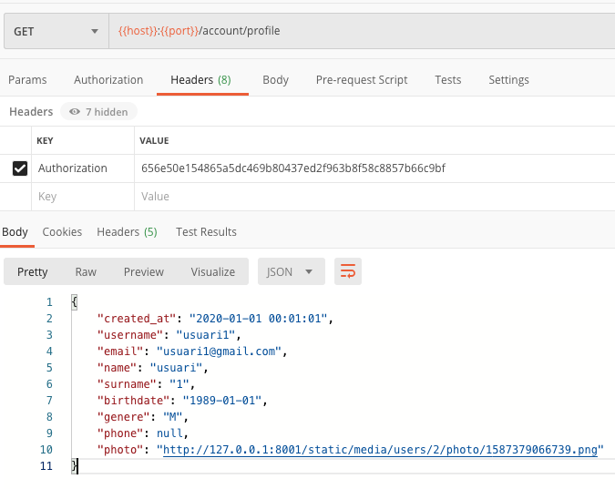
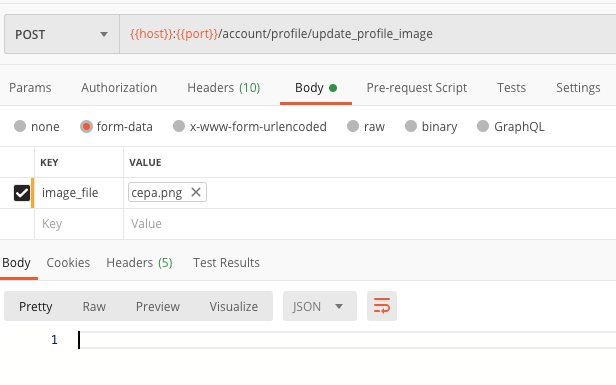
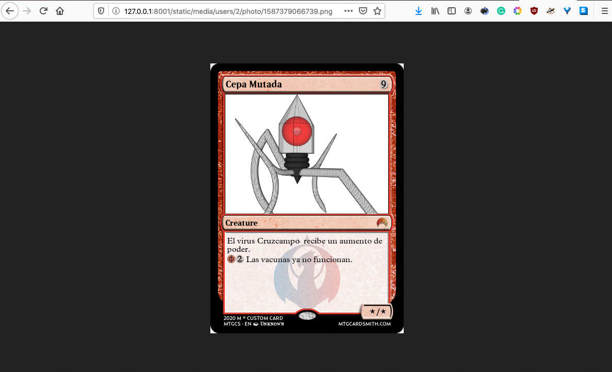

```python
# GET
application.add_route("/account/profile",
account_resources.ResourceAccountUserProfile())

#POST
application.add_route("/account/profile/update_profile_image",
account_resources.ResourceAccountUpdateProfileImage())
```

GET
---

Just ensure that in json_model in models.py:

```python
@hybrid_property
    def json_model(self):
        return {
          ...
          "photo": self.photo_url
        }
```

POST (1)
--------

```python
@falcon.before(requires_auth)
class ResourceAccountUpdateProfileImage(DAMCoreResource):
    def on_post(self, req, resp, *args, **kwargs):
        super(ResourceAccountUpdateProfileImage, self).on_post(req, resp, *args, **kwargs)
        # Get the user from the token
        current_user = req.context["auth_user"]
        resource_path = current_user.photo_path
        # Get the file from form
        incoming_file = req.get_param("image_file")
```

POST (2)
--------

```python
        # Run the common part for storing
        filename = utils
        .save_static_media_file(incoming_file, resource_path)
        # Update db model
        current_user.photo = filename
        self.db_session.add(current_user)
        self.db_session.commit()
```

save_static_media_file (utils.py) (1)
-------------------------------------

```python
def save_static_media_file(incoming_file, resource_path):
    # Generate and id with the currrent timestamp
    imgId = str(int(datetime.datetime.now().timestamp() * 1000))
    # Build filename using the id generated
    filename = imgId + "." + incoming_file.filename.split(".")[-1]
    # Check if folder exists or not in the server
    if not os.path.exists(resource_path):
        os.makedirs(resource_path)
```

save_static_media_file (utils.py) (2)
-------------------------------------

```python
    # Create a file path
    file_path = resource_path + filename
    # Write to a temporary file to prevent
    # incomplete files from being used
    temp_file_path = file_path + "~"
    with open(temp_file_path, "wb") as f:
        f.write(incoming_file.file.read())
    # File has been fully saved to disk move it into place
    os.rename(temp_file_path, file_path)
    return filename
```

Testing (1)
-------

::: center
{height="200px"}
:::

Testing (2)
-------

::: center
{height="200px"}
:::

Testing(3)
-------

::: center
{height="200px"}
:::

That is all
------------------

:::center
Well done! Thanks for your attendance! Questions?
:::

www   --- [jordimateofornes.com](https://jordimateofornes.com)

github   --- [github.com/JordiMateo](https://github.com/JordiMateoUdL)

twitter   --- [\@MatForJordi](https://twitter.com/MatForJordi)

gdc   --- [Distributed computation group](http://gcd.udl.cat)